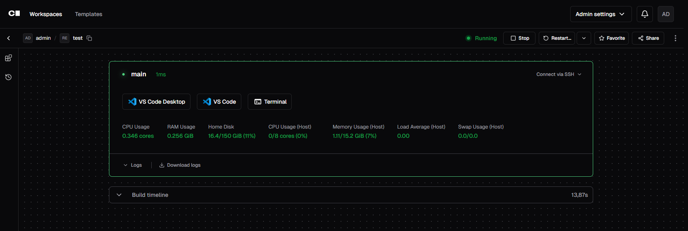
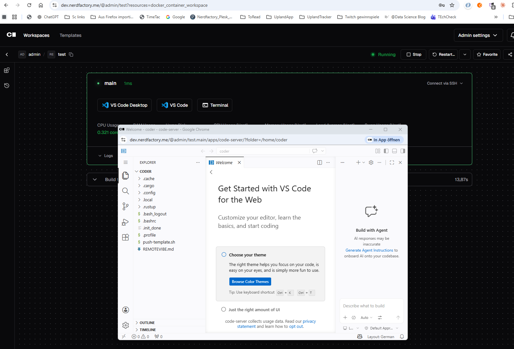
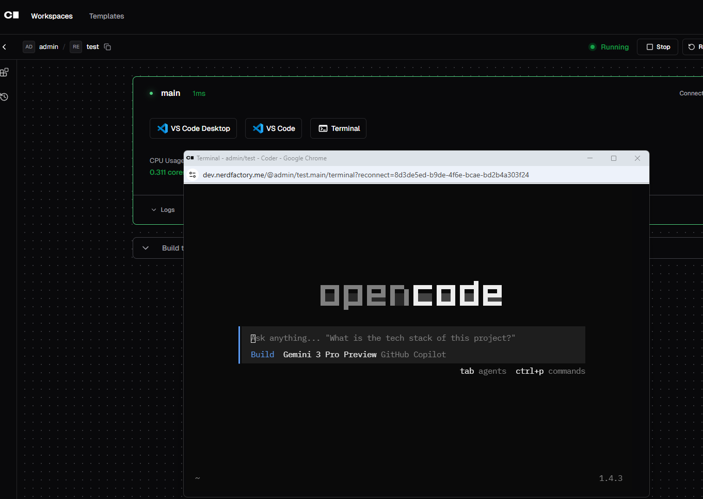
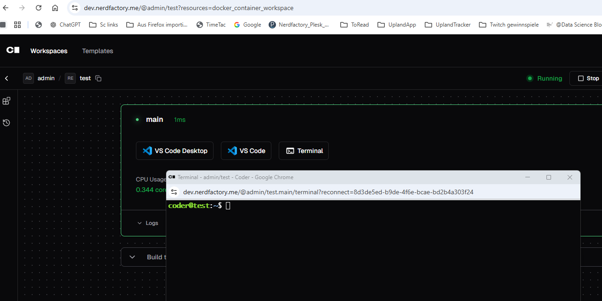

# RemoteVibeServer

**Self-hosted remote development environment for vibe coders and AI-agent workflows** — deployable via a single `cloud-init` file on any Ubuntu VPS.

No local IDE. No complex setup. Just paste the config, boot the server, and start coding with AI agents from your browser.

---

## Screenshots

| Coder Workspace Dashboard | VS Code for the Web |
|---|---|
|  |  |

| OpenCode AI Agent in Web Terminal | Browser-based Terminal |
|---|---|
|  |  |

---

## Quick Start

See [`dev-server-provision/README.md`](dev-server-provision/README.md) for the complete documentation, architecture, and deployment guide.

## What's Inside

- **Interactive configurator** — cross-platform CLI to generate `cloud-init.yaml`
- **Automated provisioning** via cloud-init (no manual SSH required)
- **Coder v2** workspace platform — VS Code Web + Desktop Remote
- **VS Code for the Web** (code-server) built into every workspace
- **AI coding agents** pre-installed: GitHub Copilot, OpenCode, Codex, Claude
- **Caddy** reverse proxy with automatic HTTPS via Cloudflare
- **Security hardened** — UFW, fail2ban, HSTS, secrets never committed

## Documentation

- [Interactive Configurator](dev-server-provision/configurator/README.md)
- [Architecture & Design Decisions](dev-server-provision/docs/architecture.md)
- [Security Model](dev-server-provision/docs/security.md)
- [Deployment Guide](dev-server-provision/docs/deployment.md)
- [Infrastructure Modules](dev-server-provision/infra/README.md)
- [Contributing](CONTRIBUTING.md)